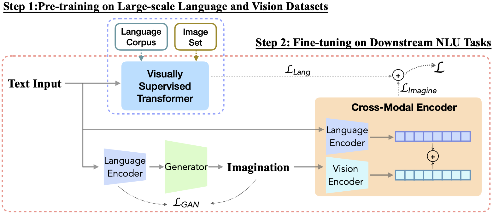

# Imagination-Augmented Natural Language Understanding
This is the official repor for our paper titled "[Imagination-Augmented Natural Language Understanding](https://arxiv.org/abs/2204.08535)", which is accepted to NAACL 2022.

## Introduction
Human brains integrate linguistic and perceptual information simultaneously to understand natural language, and hold the critical ability to render imaginations. Such abilities enable us to construct new abstract concepts or concrete objects, and are essential in involving practical knowledge to solve problems in low-resource scenarios. However, most existing methods for Natural Language Understanding (NLU) are mainly focused on textual signals. They do not simulate human visual imagination ability, which hinders models from inferring and learning efficiently from limited data samples. Therefore, we introduce an Imagination-Augmented Cross-modal Encoder (iACE) to solve natural language understanding tasks from a novel learning perspective---imagination-augmented cross-modal understanding.
iACE enables visual imagination with external knowledge transferred from the powerful generative and pre-trained vision-and-language models. Extensive experiments on GLUE and SWAG show that iACE achieves consistent improvement over visually-supervised pre-trained models. More importantly, results in extreme and normal few-shot settings validate the effectiveness of iACE in low-resource natural language understanding circumstances.

</img>

Overview of iACE. The generator G visualize imaginations close to the encoded texts by minimizing LGAN. The cross-modal encoder Ec learns imagination-augmented language representation. Two-step learning procedure consists of: 1) pre-train a Transformer with visual supervision from large-scale language corpus and image set, 2) fine-tune the visually supervised pre-trained Transformer and the imagination-augmented cross-modal encoder on downstream tasks.

## Set up

This example uses [Anaconda](https://www.anaconda.com/products/individual#Downloads) to manage virtual Python environments.

Clone our repository:

```sh
git clone --recursive 'https://github.com/YujieLu10/IACE-NLU.git'
cd IACE-NLU
```

Create a new virtual Python environment for iACE-NLU:

```sh
conda create --name iace python=3.9
conda activate iace
```

Install Pytorch in the new enviroment:

```sh
pip install torch==1.9.0+cu111 torchvision==0.10.0+cu111 torchaudio==0.9.0 -f https://download.pytorch.org/whl/torch_stable.html
```

Install other required Python packages:

```sh
pip install -r requiresments.txt
```

To install NVIDIA's apex:
```sh
git clone https://github.com/NVIDIA/apex
cd apex
pip install -v --no-cache-dir --global-option="--cpp_ext" --global-option="--cuda_ext" ./
```
## Download Experiment Datasets
Download GLUE data
```sh
cd tools
python download_glue_data.py --data_dir ../data/glue
```
Get SWAG data from <https://github.com/rowanz/swagaf/tree/master/data>

To extract subset of the data, you could simply run:
```sh
python extract_subset.py
```

## Visual Imaginary Generation
### Based on CLIP-Guided GAN
You will need at least 1 VQGAN pretrained model. E.g.

```sh
cd ImaGen
mkdir checkpoints

curl -L -o checkpoints/vqgan_imagenet_f16_16384.yaml -C - 'https://heibox.uni-heidelberg.de/d/a7530b09fed84f80a887/files/?p=%2Fconfigs%2Fmodel.yaml&dl=1'
curl -L -o checkpoints/vqgan_imagenet_f16_16384.ckpt -C - 'https://heibox.uni-heidelberg.de/d/a7530b09fed84f80a887/files/?p=%2Fckpts%2Flast.ckpt&dl=1'
```

The `download_models.sh` script in **ImaGen** directory is an optional way to download a number of models. By default, it will download just 1 model.

See <https://github.com/nerdyrodent/VQGAN-CLIP.git> for more information about VQGAN+CLIP.

### Based on CLIP-Guided Diffusion
You will need at least 1 Diffusion pretrained model. E.g.

```sh
cd ImaGen/checkpoints
curl -OL --http1.1 'https://v-diffusion.s3.us-west-2.amazonaws.com/512x512_diffusion_uncond_finetune_008100.pt'
curl -OL 'https://openaipublic.blob.core.windows.net/diffusion/jul-2021/256x256_diffusion_uncond.pt'
```

See <https://github.com/nerdyrodent/CLIP-Guided-Diffusion> for more information about VQGAN+CLIP.

### Imagination Construction

You can generate imagination data for the GLUE and SWAG by specifying the dataset and output directory:

```sh
# Using GAN
CUDA_VISIBLE_DEVICES=0 python generate_imagination.py -rp glue_task_split
# For glue_mnli_train: CUDA_VISIBLE_DEVICES=0 python generate_imagination.py -rp glue_mnli_train
CUDA_VISIBLE_DEVICES=0 python generate_imagination.py -rp swag
# Using Diffusion
CUDA_VISIBLE_DEVICES=0 python generate_diffuse.py -rp glue_task_split
CUDA_VISIBLE_DEVICES=0 python generate_diffuse.py -rp swag
```

To generate one example, you can specify your text prompt as shown in the example below:
```sh
python generate_imagination.py -p "Down by the salley gardens my love and I did meet"
python generate_diffuse.py -p "Down by the salley gardens my love and I did meet"
```
</img>

You can then extract features of the glue and swag dataset by (use 'eval' option for dev split):

```sh
cd tools
python extract_feature.py -rp glue
python extract_feature.py -rp swag
```

## Visually-Supervised Transformer

More details for pre-training the visually-supervised transformer can be found at [Vokenization](https://github.com/airsplay/vokenization).


## Imagination-Augmented NLU
To fine-tune over glue, you can do by:
```sh CME
bash scripts/run_glue_at_epoch.bash 0,1,2,3 30 bert_base 30 langvis loading bert bert-base-uncased 5 32 100
```
Similary, to fine-tune over swag, you can:
```sh CME
bash scripts/run_swag_at_epoch.bash 0,1,2,3 30 bert_base 30 langvis loading bert bert-base-uncased 5 32 100
```

## Citations
If you find our repo useful, please cite this paper:
```bibtex
@misc{https://doi.org/10.48550/arxiv.2204.08535,
  doi = {10.48550/ARXIV.2204.08535},
  url = {https://arxiv.org/abs/2204.08535},
  author = {Lu, Yujie and Zhu, Wanrong and Wang, Xin Eric and Eckstein, Miguel and Wang, William Yang},
  keywords = {Computation and Language (cs.CL), FOS: Computer and information sciences, FOS: Computer and information sciences},
  title = {Imagination-Augmented Natural Language Understanding},
  publisher = {arXiv},
  year = {2022},
  copyright = {Creative Commons Attribution 4.0 International}
}
```

## Acknowledgements
We thank the authors of [vokenization](https://github.com/airsplay/vokenization), [VQGAN-CLIP](https://github.com/nerdyrodent/VQGAN-CLIP), [CLIP-Guided-Diffusion
](https://github.com/nerdyrodent/CLIP-Guided-Diffusion) for releasing their code.